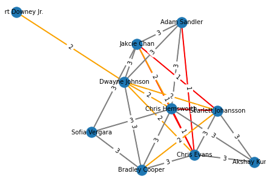

# <center> Six degrees of movies </center>

This project is aimed to create a simple backend infrastructure for a "guess" game that I have come up with. 

Given 2 distinct actors/actresses we can connect them through some mutual connections. These connections are established through the movies the actor/actress has starred in and the respective cast for that particular movie. Those are level-1 connections. Similarly, iterating through level-1 connections' movies, we can establish level-2 connections and so on. Hence, we get a connected graph made of people as vertices and movies as edges. The same approach can be applied to movies that are deemed to be connected through actors/actresses. 

The "guess" game starts after the connecting "pieces" are found. The intermediate vertices are not going to be explicitly stated, but have to be guessed from a word cloud that is comprised of the roles the person has played. Movies, on the other hand, would have their description embedded into a word cloud.

## 1. Solution architecture

To tackle this task we need the data that would enable us to connect people through movies and vice versa. I will utilize information from IMDB website. So easy, IMDB got all the information stored in ready-made tables for us to download and put into use... No so fast. Let's take a look at some tables.

From this [link](https://www.imdb.com/interfaces/) here we can get 2 interesting datasets:
<table>
    <tr>
       <td> <center> Actors/Actresses data </center> </td> 
       <td> <center> Movie title data </center> </td>
    </tr>
    <tr>
       <td> </td>
       <td>  </td>
</tr></table>


I have downloaded the 2 datasets and unzipped them. Upon further inspection, though, the information presented does not seem complete:

   ###           Names dataset 


```python
# Nan values are specified as \N (default for PostgreSQL)
df_names_dset = pd.read_csv(r"..\Downloads\names.tsv", sep='\t', na_values='\\N')
```


```python
df_names_dset.head()
```


<div>
<style scoped>
    .dataframe tbody tr th:only-of-type {
        vertical-align: middle;
    }

    .dataframe tbody tr th {
        vertical-align: top;
    }

    .dataframe thead th {
        text-align: right;
    }
</style>
<table border="1" class="dataframe">
  <thead>
    <tr style="text-align: right;">
      <th></th>
      <th>nconst</th>
      <th>primaryName</th>
      <th>birthYear</th>
      <th>deathYear</th>
      <th>primaryProfession</th>
      <th>knownForTitles</th>
    </tr>
  </thead>
  <tbody>
    <tr>
      <th>0</th>
      <td>nm0000001</td>
      <td>Fred Astaire</td>
      <td>1899.0</td>
      <td>1987.0</td>
      <td>soundtrack,actor,miscellaneous</td>
      <td>tt0031983,tt0072308,tt0053137,tt0050419</td>
    </tr>
    <tr>
      <th>1</th>
      <td>nm0000002</td>
      <td>Lauren Bacall</td>
      <td>1924.0</td>
      <td>2014.0</td>
      <td>actress,soundtrack</td>
      <td>tt0117057,tt0071877,tt0037382,tt0038355</td>
    </tr>
    <tr>
      <th>2</th>
      <td>nm0000003</td>
      <td>Brigitte Bardot</td>
      <td>1934.0</td>
      <td>NaN</td>
      <td>actress,soundtrack,music_department</td>
      <td>tt0057345,tt0054452,tt0056404,tt0049189</td>
    </tr>
    <tr>
      <th>3</th>
      <td>nm0000004</td>
      <td>John Belushi</td>
      <td>1949.0</td>
      <td>1982.0</td>
      <td>actor,soundtrack,writer</td>
      <td>tt0072562,tt0080455,tt0078723,tt0077975</td>
    </tr>
    <tr>
      <th>4</th>
      <td>nm0000005</td>
      <td>Ingmar Bergman</td>
      <td>1918.0</td>
      <td>2007.0</td>
      <td>writer,director,actor</td>
      <td>tt0050976,tt0083922,tt0060827,tt0050986</td>
    </tr>
  </tbody>
</table>
</div>


```python
df_names_dset.shape
```


    (11365793, 6)


```python
df_names_dset.loc[:, 'knownForTitles'].map(lambda x: str(x).split(',')).map(lambda y: len(y)).max()
```


    6


First I create lists from strings with title ids and then find the length of each list and locate the max. It appears that `knownForTitles` column has at most 6 movies per name. 


```python
df_names_dset[df_names_dset['primaryName'] == 'Brad Pitt']
```


<div>
<style scoped>
    .dataframe tbody tr th:only-of-type {
        vertical-align: middle;
    }

    .dataframe tbody tr th {
        vertical-align: top;
    }

    .dataframe thead th {
        text-align: right;
    }
</style>
<table border="1" class="dataframe">
  <thead>
    <tr style="text-align: right;">
      <th></th>
      <th>nconst</th>
      <th>primaryName</th>
      <th>birthYear</th>
      <th>deathYear</th>
      <th>primaryProfession</th>
      <th>knownForTitles</th>
    </tr>
  </thead>
  <tbody>
    <tr>
      <th>92</th>
      <td>nm0000093</td>
      <td>Brad Pitt</td>
      <td>1963.0</td>
      <td>NaN</td>
      <td>actor,producer,soundtrack</td>
      <td>tt1210166,tt0114746,tt0356910,tt2935510</td>
    </tr>
  </tbody>
</table>
</div>


Brad Pitt has only 4. Clearly top actors have starred in more pictures than that.

### Movies dataset


```python
df_movies_dset = pd.read_csv('../Downloads/data.tsv', sep='\t', na_values='\\N')
```


```python
df_movies_dset.head()
```


<div>
<style scoped>
    .dataframe tbody tr th:only-of-type {
        vertical-align: middle;
    }

    .dataframe tbody tr th {
        vertical-align: top;
    }

    .dataframe thead th {
        text-align: right;
    }
</style>
<table border="1" class="dataframe">
  <thead>
    <tr style="text-align: right;">
      <th></th>
      <th>tconst</th>
      <th>ordering</th>
      <th>nconst</th>
      <th>category</th>
      <th>job</th>
      <th>characters</th>
    </tr>
  </thead>
  <tbody>
    <tr>
      <th>0</th>
      <td>tt0000001</td>
      <td>1</td>
      <td>nm1588970</td>
      <td>self</td>
      <td>NaN</td>
      <td>["Self"]</td>
    </tr>
    <tr>
      <th>1</th>
      <td>tt0000001</td>
      <td>2</td>
      <td>nm0005690</td>
      <td>director</td>
      <td>NaN</td>
      <td>NaN</td>
    </tr>
    <tr>
      <th>2</th>
      <td>tt0000001</td>
      <td>3</td>
      <td>nm0374658</td>
      <td>cinematographer</td>
      <td>director of photography</td>
      <td>NaN</td>
    </tr>
    <tr>
      <th>3</th>
      <td>tt0000002</td>
      <td>1</td>
      <td>nm0721526</td>
      <td>director</td>
      <td>NaN</td>
      <td>NaN</td>
    </tr>
    <tr>
      <th>4</th>
      <td>tt0000002</td>
      <td>2</td>
      <td>nm1335271</td>
      <td>composer</td>
      <td>NaN</td>
      <td>NaN</td>
    </tr>
  </tbody>
</table>
</div>


```python
df_movies_dset.category.value_counts()
```


    actor                  10715354
    self                    8282716
    actress                 8136955
    writer                  6354300
    director                5510362
    producer                3019841
    composer                1675693
    cinematographer         1672899
    editor                  1584835
    production_designer      333427
    archive_footage          297810
    archive_sound              2819
    Name: category, dtype: int64


I am only interested in actors and actresses, although `self` also seems to include the acting personnel. So, let's find how many actors/actresses per movie we can find at most in this dataset:


```python
df_movies_dset[df_movies_dset['category'].isin(['actor', 'actress', 'self'])].groupby('tconst')['ordering'].count().max()
```


    10


10 characters at most. Doesn't seem to be sufficient. The data will have to be scraped from the website. There is a public API available, although the free version of 100-1000 requests per day is not going to suffice for this project with ~8 million movies and even more cast. We will make sure not to interfere with servers too much in this process.

The data we want is presented in the static manner, so I BeautifulSoup from bs4 library would be able to handle the job pretty well.

According to [similarweb](https://www.similarweb.com/website/imdb.com/#overview) resource, in October 2021 IMDB.com received ~500m visits, which converts to approximate 187 visits per second. In fact, a single visit to this website makes over 100 requests for various javascripts, pictures, stylesheets and so on... While we are going be sending only 1 request per our subject of interest. So, we can send ~ 187 * 60(50% for safety) * 0.005(0.5%) = 55 requests per second to stay within 0.5% of average requests. Will make it an even 50 to make life easy and round. To enforce quick requests and keep track of the connections I'll use `asyncio` library

## Imports


```python
import requests
from bs4 import BeautifulSoup
import re
import numpy as np
import os
import matplotlib.pyplot as plt
import asyncio
import aiohttp
import nest_asyncio
import psycopg2
from config import config

from collections import deque
import networkx as nx
from PIL import Image
from wordcloud import WordCloud, STOPWORDS, ImageColorGenerator

%matplotlib inline
```


```python
headers = {'Accept-language': 'en', 'X-FORWARDED-FOR': '134.201.250.155'}
```


```python
response = requests.get("https://www.imdb.com/name/nm0000246/", headers=headers)
response.status_code
```


    200


## Main Functions


```python
def sql_create_tables():
    conn = None
    try:
        params = config()
        conn = psycopg2.connect(**params)
        cur = conn.cursor()
        
        cur.execute('''CREATE TABLE IF NOT EXISTS actors (act_id VARCHAR(20) PRIMARY KEY, 
                                            name VARCHAR(80));''')
        
        cur.execute('''CREATE TABLE IF NOT EXISTS movies  (mov_id VARCHAR(20) PRIMARY KEY, 
                                            title VARCHAR(80),
                                            description VARCHAR(2000));''')
        conn.commit()
        cur.execute("""CREATE TABLE IF NOT EXISTS relations (mov_id VARCHAR(20), 
                                            act_id VARCHAR(20),
                                            roles VARCHAR(1000),
                                            
                                                FOREIGN KEY(mov_id)
                                                    REFERENCES movies(mov_id),
                                            
                                            FOREIGN KEY(act_id) REFERENCES actors(act_id));""")
        
    except (Exception, psycopg2.DatabaseError) as error:
        print(error)

    finally:
        if conn is not None:
            conn.commit()
            conn.close()
    
```


```python
# modify to keep connection open
def dump_movies(actors_list, connection=None):
    if not connection:
        params = config()
        connection = psycopg2.connect(**params)
    with connection.cursor() as cursor:
        psycopg2.extras.execute_batch(cursor, """
        INSERT INTO movies VALUES (%s, %s, %s);""", mov_list)
        
    global movies_to_upload
    movies_to_upload = []
```


```python
# modify to keep connection open
def dump_relations(actors_list, connection=None):
    if not connection:
        params = config()
        connection = psycopg2.connect(**params)
    with connection.cursor() as cursor:
        psycopg2.extras.execute_batch(cursor, """
        INSERT INTO relations VALUES (%s, %s, %s);""", relations_list)
        
    global relations_to_upload
    relations_to_upload = []
```


```python
# modify to keep connection open
def dump_actors(actors_list, connection=None):
    if not connection:
        params = config()
        connection = psycopg2.connect(**params)
    with connection.cursor() as cursor:
        psycopg2.extras.execute_batch(cursor, """
        INSERT INTO actors VALUES (%s, %s);""", actors_list)
        
    global actors_to_upload
    actors_to_upload = []
```


```python
def reset_globals():
    global Errors_list
    Errors_list = {'Movies':[], 'Actors': []}
    global actor_visited
    actor_visited = []
    global movie_visited
    movie_visited = []
    global relations_to_upload
    relations_to_upload = []
    global actors_to_upload
    actors_to_upload = []
    global movies_to_upload
    movies_to_upload = []
```


```python
headers = {'Accept-language': 'en', 'X-FORWARDED-FOR': '134.199.255.155'}
Errors_list = {'Movies':[], 'Actors': []}
actor_visited = []
movie_visited = []

relations_to_upload = []
actors_to_upload = []
movies_to_upload = []
```


```python
def get_actors_by_movie_soup(cast_page_soup):
    actor_list = []
    mv_id = cast_page_soup.find('h3').find('a')['href'].split('/')[-2]
    global Errors_list
    
    try:
        act_res_set = cast_page_soup.find('div', attrs={'id': 'fullcredits_content'}) \
                                    .find('table', attrs={'class': 'cast_list'}) \
                                    .find_all('tr', attrs={'class': ['even', 'odd']})
        
#         movie_load1 = movie_soup.find('h1').text
#         movie_load2 = movie_soup.find('div', attrs={'data-testid': 'storyline-plot-summary'}) \
#                                 .find('div', attrs={'class': None}).text.strip()
        
        global movies_to_upload
        movies_to_upload.append((mv_id, '\\N', '\\N'))
        

        
    except AttributeError:
        Errors_list['Movies'].append(mv_id)
        print('ERRORMOV')

    
    for actor in range(len(act_res_set)):
        try:
            actor_details = act_res_set[actor].find('td', attrs={'class': None})
            act_link = actor_details.find('a')
            act_id = act_link['href'].split('/')[2]
            #Is this check needed?
            if act_id not in actor_visited:
                actor_list.append((actor_details.text.strip(), \
                                  'https://imdb.com' + act_link['href'], act_id))

        except AttributeError:
            Errors_list['Actors'].append(actor)
            print('ERRORACT')

           
    if len(movies_to_upload) > 10000:
        dump_movies(movies_to_upload)
    
    global movie_visited
    movie_visited.append(mv_id)
        
    return actor_list
```


```python
def get_movies_by_actor_soup(actor_page_soup):
    movies_list = []
    act_id = actor_page_soup.find('link', attrs={'rel': 'canonical'})['href'].split('/')[-2]
    act_name = actor_page_soup.find('h1').find('span', attrs={'class': 'itemprop'}).text
    
    

    movies_to_omit = ['(\s|.)*TV Series(\s|.)*', 'Short', 'Video Game', 'Video short', 'Video', 'TV Movie',
                      '(\s|.)*TV Mini-Series(\s|.)*',
                      'TV Special', 'TV Short', 'TV Mini-Series short', 'announced', 'filming', 'pre-production',
                      'post-production',
                      'completed', 'script']
    
    pattern_main = re.compile('\\(' + '\\)|\\('.join(movies_to_omit) + '\\)')

    try:
        search_result = actor_page_soup.find_all('div', attrs={'class': 'filmo-row', 'id': re.compile('(actor)|(actress)-.+')})
        search_range = len(search_result)
    except AttributeError:
        global Errors_list
        Errors_list['Actors'].append(actor)
        return []
    

    for i in search_result:
        if not any(re.match(pattern_main, line) for line in i.text.split('\n')):
            m_title = i.find('a').text.strip()
            role = re.match(re.compile('\A[\w\s\.]*(?!\\()'), i.text.split('\n')[6]).group().strip()

            if not role:
                role = '\\N'
                
            m_id = i.find('a')['href'].split('/')[2]

            movies_list.append(
                (m_title, 'https://imdb.com' + i.find('a')['href'], m_id))

            
            global relations_to_upload
            relations_to_upload.append((m_id, act_id, role))
            
    if len(relations_to_upload) > 10000:
        dump_relations(relations_to_upload)
    

    global actors_to_upload
    actors_to_upload.append((act_id, act_name))
    
    if len(actors_to_upload) > 10000:
        dump_actors(actors_to_upload)
    

    return movies_list
```


```python
async def get_soups_acts(actor_links):
    async with aiohttp.ClientSession(headers=headers) as session:
        coroutines = [fetch_sem(session, url[1], sem) if type(url) == tuple else\
                      fetch_sem(session, url, sem) for url in actor_links]
        result = await asyncio.gather(*coroutines)
        return result

```


```python
async def get_soups_movs(mov_links):
    async with aiohttp.ClientSession(headers=headers) as session:
        coroutines = [fetch_sem(session, url[1] + 'fullcredits', sem)  for url in mov_links]
        result = await asyncio.gather(*coroutines)
        return result
```


```python

```


```python
async def fetch_sem(session, url, sem):
    async with sem:
        async with session.get(url) as response:
            return await response.text()
        
sem = asyncio.Semaphore(20)
```


```python
reset_globals()
url = "https://www.imdb.com/title/tt0114746/fullcredits"
url2 = "https://www.imdb.com/title/tt0114746/"
resp = requests.get(url)
resp2 = requests.get(url2)
soup = BeautifulSoup(resp.text)
soup2 = BeautifulSoup(resp2.text)
actor_links = get_actors_by_movie_soup(soup, soup2)
```


```python
#split into 2 funcs for actor_q and movie_q
def bfs_scrap(start_url, actor_q, movie_q, counter = 0): #, actor_visited=[],movie_visited=[]):
    global actor_visited
    global movie_visited
    headers = {'Accept-language': 'en', 'X-FORWARDED-FOR': '134.201.250.155'}
    if counter == 2:
        return 'Done'
    while actor_q:
        current_actor_links = actor_q.popleft()
        cur_act_ids = np.array([i.split('/')[-2] if type(i) == str else i[1].split('/')[-2] for i in current_actor_links])


        new_act_mask = [x not in actor_visited for x in cur_act_ids]
        current_actor_links = np.array(current_actor_links)[new_act_mask]

        loop = asyncio.get_event_loop()
        nest_asyncio.apply(loop)
        coroutine = get_soups_acts(current_actor_links)
        current_movies_resps = loop.run_until_complete(coroutine)

        movies_to_check = []
        for url in current_movies_resps:

            movies_to_check += get_movies_by_actor_soup(BeautifulSoup(url))
        
        mask_q = [y not in movie_visited for y in movies_to_check]
        movie_q.append(np.array(movies_to_check)[mask_q])

    actor_visited.extend(cur_act_ids[new_act_mask])

    while movie_q:
        current_movie_links = movie_q.popleft()
        cur_mov_ids = np.array([m[1].split('/')[-2] for m in current_movie_links])
        new_mov_mask = [x not in movie_visited for x in cur_mov_ids]
        current_mov_links = current_movie_links[new_mov_mask]
        current_mov_links = [x + 'fullcredits' for x in current_mov_links[:, 1]]
        
        loop = asyncio.get_event_loop()
        nest_asyncio.apply(loop)
        coroutine = get_soups_acts(current_mov_links)
        current_act_resps = loop.run_until_complete(coroutine)

        acts_to_check = []
        for url in current_act_resps:
            acts_to_check += get_actors_by_movie_soup(BeautifulSoup(url))
            
            
        mask_q = [e not in actor_visited for e in acts_to_check]
        actor_q.append(np.array(acts_to_check)[mask_q])


    movie_visited.extend(cur_mov_ids[new_mov_mask])

    return bfs_scrap(start_url, actor_q, movie_q, counter = counter+1)
```


```python
def parse_imdb(actor_start_url):
    reset_globals()
    actor_start_url = actor_start_url.replace('www.', '')
    sql_create_tables()
    movie_q = deque()
    actor_q = deque()
    actor_q.append([actor_start_url])
    return bfs_scrap(actor_start_url, actor_q=actor_q, movie_q=movie_q)


```


```python
parse_imdb("https://www.imdb.com/name/nm0000246/")
```


    ---------------------------------------------------------------------------

    TypeError                                 Traceback (most recent call last)

    ~\AppData\Local\Temp/ipykernel_22436/3401157688.py in <module>
    ----> 1 parse_imdb("https://www.imdb.com/name/nm0000246/")
    

    ~\AppData\Local\Temp/ipykernel_22436/184482012.py in parse_imdb(actor_start_url)
          6     actor_q = deque()
          7     actor_q.append([actor_start_url])
    ----> 8     return bfs_scrap(actor_start_url, actor_q=actor_q, movie_q=movie_q)
          9 
    

    ~\AppData\Local\Temp/ipykernel_22436/3492416079.py in bfs_scrap(start_url, actor_q, movie_q, counter)
         53     movie_visited.extend(cur_mov_ids[new_mov_mask])
         54 
    ---> 55     return bfs_scrap(start_url, actor_q, movie_q, counter = counter+1)
    

    ~\AppData\Local\Temp/ipykernel_22436/3492416079.py in bfs_scrap(start_url, actor_q, movie_q, counter)
         17         nest_asyncio.apply(loop)
         18         coroutine = get_soups_acts(current_actor_links)
    ---> 19         current_movies_resps = loop.run_until_complete(coroutine)
         20 
         21         movies_to_check = []
    

    ~\anaconda3\envs\IMDB_scraping_proj\lib\site-packages\nest_asyncio.py in run_until_complete(self, future)
         68                 raise RuntimeError(
         69                     'Event loop stopped before Future completed.')
    ---> 70             return f.result()
         71 
         72     def _run_once(self):
    

    ~\anaconda3\envs\IMDB_scraping_proj\lib\asyncio\futures.py in result(self)
        199         self.__log_traceback = False
        200         if self._exception is not None:
    --> 201             raise self._exception
        202         return self._result
        203 
    

    ~\anaconda3\envs\IMDB_scraping_proj\lib\asyncio\tasks.py in __step(***failed resolving arguments***)
        254                 # We use the `send` method directly, because coroutines
        255                 # don't have `__iter__` and `__next__` methods.
    --> 256                 result = coro.send(None)
        257             else:
        258                 result = coro.throw(exc)
    

    ~\AppData\Local\Temp/ipykernel_22436/428210363.py in get_soups_acts(actor_links)
          3         coroutines = [fetch_sem(session, url[1], sem) if type(url) == tuple else\
          4                       fetch_sem(session, url, sem) for url in actor_links]
    ----> 5         result = await asyncio.gather(*coroutines)
          6         return result
    

    ~\anaconda3\envs\IMDB_scraping_proj\lib\asyncio\tasks.py in __wakeup(self, future)
        326     def __wakeup(self, future):
        327         try:
    --> 328             future.result()
        329         except BaseException as exc:
        330             # This may also be a cancellation.
    

    ~\anaconda3\envs\IMDB_scraping_proj\lib\asyncio\tasks.py in __step(***failed resolving arguments***)
        254                 # We use the `send` method directly, because coroutines
        255                 # don't have `__iter__` and `__next__` methods.
    --> 256                 result = coro.send(None)
        257             else:
        258                 result = coro.throw(exc)
    

    ~\AppData\Local\Temp/ipykernel_22436/2372827105.py in fetch_sem(session, url, sem)
          1 async def fetch_sem(session, url, sem):
          2     async with sem:
    ----> 3         async with session.get(url) as response:
          4             return await response.text()
          5 
    

    ~\anaconda3\envs\IMDB_scraping_proj\lib\site-packages\aiohttp\client.py in __aenter__(self)
       1115 
       1116     async def __aenter__(self) -> _RetType:
    -> 1117         self._resp = await self._coro
       1118         return self._resp
       1119 
    

    ~\anaconda3\envs\IMDB_scraping_proj\lib\site-packages\aiohttp\client.py in _request(self, method, str_or_url, params, data, json, cookies, headers, skip_auto_headers, auth, allow_redirects, max_redirects, compress, chunked, expect100, raise_for_status, read_until_eof, proxy, proxy_auth, timeout, verify_ssl, fingerprint, ssl_context, ssl, proxy_headers, trace_request_ctx, read_bufsize)
        402 
        403         try:
    --> 404             url = URL(str_or_url)
        405         except ValueError as e:
        406             raise InvalidURL(str_or_url) from e
    

    ~\anaconda3\envs\IMDB_scraping_proj\lib\site-packages\yarl\_url.py in __new__(cls, val, encoded, strict)
        156             val = urlsplit(str(val))
        157         else:
    --> 158             raise TypeError("Constructor parameter should be str")
        159 
        160         if not encoded:
    

    TypeError: Constructor parameter should be str


## Auxiliary stuff for graphics


```python
actors_to_find = [('Dwayne Johnson', 'https://imdb.com/name/nm0425005/'), ('Chris Hemsworth', 'https://imdb.com/name/nm1165110/'),
                 ('Robert Downey Jr.', 'https://imdb.com/name/nm0000375/'), ('Akshay Kumar', 'https://imdb.com/name/nm0474774/'),
                 ('Jakcie Chan', 'https://imdb.com/name/nm0000329/'), ('Bradley Cooper', 'https://imdb.com/name/nm0177896/'),
                 ('Adam Sandler','https://imdb.com/name/nm0001191/'), ('Scarlett Johansson', 'https://imdb.com/name/nm0424060/'),
                 ('Sofia Vergara', 'https://imdb.com/name/nm0005527/'), ('Chris Evans', 'https://imdb.com/name/nm0262635/')]
```


```python
def get_movie_descriptions_by_actor_soup(actor_page_soup):
    actor_movie_desc = []
    movies_links = []
    for movie, movie_link in get_movies_by_actor_soup(actor_page_soup):
        movies_links.append(movie_link)
    
    for link in movies_links:
        movie_soup = BeautifulSoup(requests.get(link, headers=headers).text, features='lxml')
        search = movie_soup.find('div', attrs={'class': 'summary_text'}).text.strip().lower()
        actor_movie_desc.append(search + ' ')
    return actor_movie_desc
```


```python
def save_descriptions(movies_description, actor_page_soup, directory=''):
    name = actor_page_soup.find('h1', attrs={'class': 'header'}).find('span', attrs={'class': 'itemprop'}).text
    url = actor_page_soup.find('meta', attrs={'property': 'og:url'})['content']
    if not os.path.exists(directory):
        os.makedirs(directory)
    save_path = os.path.join(directory, name + '.txt')
    with open(save_path, 'w') as f:
        f.write(''.join(movies_description))
```


```python
headers = {'Accept-language': 'en', 'X-FORWARDED-FOR': '134.201.250.155'}
for actor, link in actors_to_find:
    actor_page_soup = BeautifulSoup(requests.get(link, headers=headers).text, features='lxml')
    descr = get_movie_descriptions_by_actor_soup(actor_page_soup)
    save_descriptions(descr, actor_page_soup, directory = 'descriptions')
```


```python
actors_to_find = [('Dwayne Johnson', 'https://www.imdb.com/name/nm0425005/'), ('Chris Hemsworth', 'https://www.imdb.com/name/nm1165110/'),
                 ('Robert Downey Jr.', 'https://www.imdb.com/name/nm0000375/'), ('Akshay Kumar', 'https://www.imdb.com/name/nm0474774/'),
                 ('Jakcie Chan', 'https://www.imdb.com/name/nm0000329/'), ('Bradley Cooper', 'https://www.imdb.com/name/nm0177896/'),
                 ('Adam Sandler','https://www.imdb.com/name/nm0001191/'), ('Scarlett Johansson', 'https://www.imdb.com/name/nm0424060/'),
                 ('Sofia Vergara', 'https://www.imdb.com/name/nm0005527/'), ('Chris Evans', 'https://www.imdb.com/name/nm0262635/')]

distance_matrix = np.empty(shape=(10,10))
distance_matrix[:] = np.nan
distance_matrix = np.load('distances.npy')

for a in range(10):
    for b in range(9, a, -1):
        if a == b:
            distance_matrix[a][b] = 0
        elif type(distance_matrix[a][b]) != int:
            distance = get_movie_distance(actors_to_find[a][1], actors_to_find[b][1], num_of_actors_limit = 5, num_of_movies_limit = 5)
            
            distance_matrix[a][b], distance_matrix[b][a]  = distance, distance
            np.save('distances.npy', distance_matrix)
```

# WORDCLOUDS


```python
#os.chdir(os.getcwd() +'\\descriptions')
fig, axs = plt.subplots(2, 5)
fig.set_size_inches(40, 20)
row = 0
col = 0
for file in os.listdir():
    if file.endswith('.txt'):
        with open(file) as f:
            
            text = f.read()
            text.replace('see full summary »', '')
            stopwords = set(list(STOPWORDS)+['full summary', 'see', 'full', 'see full', 'summary', 'new', 'must'])
            mask = np.array(Image.open("mask.jpg"))
            wordcl = WordCloud(stopwords=stopwords, background_color="white", mask=mask, max_words=80).generate(text)

            
            axs[row, col].plot()
            axs[row, col].imshow(wordcl, interpolation='bilinear', aspect='auto')
            axs[row, col].axis('off')
            axs[row, col].set_title(file.split('.')[0])
            col += 1
            if col == 5:
                row = 1
                col = 0
            
            
            
```


    

    


```python
os.chdir('descriptions')
for file in os.listdir():
    if file.endswith('.txt'):
        with open(file) as f:
            
            text = f.read()
            text.replace('see full summary »', '')
            stopwords = set(list(STOPWORDS)+['full summary', 'see', 'full', 'see full', 'summary', 'new', 'must'])
            mask = np.array(Image.open("mask.jpg"))
            wordcl = WordCloud(stopwords=stopwords, background_color="white", mask=mask, max_words=80).generate(text)
            
            plt.plot()
            plt.imshow(wordcl, interpolation='bilinear', aspect='equal')
            plt.axis('off')
            plt.show()
```


    

    


    

    


    

    


    

    


    

    


    

    


    

    


    

    


    

    


    

    


```python
os.chdir('..')
```

# NETWORKX GRAPHS


```python
distance_matrix = np.load('distances.npy')
```


```python
actors_to_find = [('Dwayne Johnson', 'https://www.imdb.com/name/nm0425005/'), ('Chris Hemsworth', 'https://www.imdb.com/name/nm1165110/'),
                 ('Robert Downey Jr.', 'https://www.imdb.com/name/nm0000375/'), ('Akshay Kumar', 'https://www.imdb.com/name/nm0474774/'),
                 ('Jakcie Chan', 'https://www.imdb.com/name/nm0000329/'), ('Bradley Cooper', 'https://www.imdb.com/name/nm0177896/'),
                 ('Adam Sandler','https://www.imdb.com/name/nm0001191/'), ('Scarlett Johansson', 'https://www.imdb.com/name/nm0424060/'),
                ('Sofia Vergara', 'https://www.imdb.com/name/nm0005527/'), ('Chris Evans', 'https://www.imdb.com/name/nm0262635/')]
```


```python
def draw_graph(include=None):
    G = nx.Graph()
    for i in range(10):
        for j in range(9, i, -1):
            w = distance_matrix[i][j]
            if 0 < w < 4:
                if not include or (include and w == include):
                    G.add_edge(actors_to_find[i][0], actors_to_find[j][0], weight = w, r=int(w))
    
    len_1 = [(u, v) for (u, v, d) in G.edges(data=True) if d["weight"] == 1] 
    len_2 = [(u, v) for (u, v, d) in G.edges(data=True) if d["weight"] == 2] 
    len_3 = [(u, v) for (u, v, d) in G.edges(data=True) if d["weight"] == 3]
    
    pos = nx.spring_layout(G)
    nx.draw(G, pos, node_size=300)

    nx.draw_networkx_edges(G, pos, edgelist=len_1, width=2, edge_color = 'red')
    nx.draw_networkx_edges(G, pos, edgelist=len_2, width=2, edge_color="orange")
    nx.draw_networkx_edges(G, pos, edgelist=len_3, width=2, edge_color="grey")
    # labels
    nx.draw_networkx_labels(G, pos, font_size=10, font_family="sans-serif")
    edge_labels = nx.get_edge_attributes(G, 'r')
    nx.draw_networkx_edge_labels(G, pos, edge_labels = edge_labels)
    plt.figure(figsize=(2,2))
    plt.axis("off")
    plt.show()
```


```python
draw_graph()
```


    

    


    

    


```python
draw_graph(1)
```


    

    


    

    


```python
draw_graph(2)
```


    

    


    

    


```python
draw_graph(3)
```


    

    


    

    


```python

```
