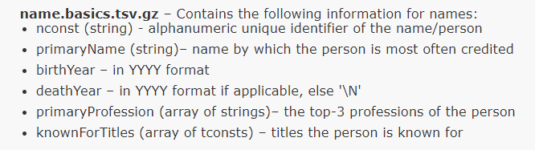

# <center> Six degrees of movies </center>

This project is aimed to create a simple backend infrastructure for a "guess" game that I have come up with. 

Given 2 distinct actors/actresses we can connect them through some mutual connections. These connections are established through the movies the actor/actress has starred in and the respective cast for that particular movie. Those are level-1 connections. Similarly, iterating through level-1 connections' movies, we can establish level-2 connections and so on. Hence, we get a connected graph made of people as vertices and movies as edges. The same approach can be applied to movies that are deemed to be connected through actors/actresses. 

The "guess" game starts after the connecting "pieces" are found. The intermediate vertices are not going to be explicitly stated, but have to be guessed from a word cloud that is comprised of the roles the person has played. Movies, on the other hand, would have their description embedded into a word cloud.

## 1. Solution architecture

To tackle this task we need the data that would enable us to connect people through movies and vice versa. I will utilize information from IMDB website. So easy, IMDB got all the information stored in ready-made tables for us to download and put into use... No so fast. Let's take a look at some tables.

From this [link](https://www.imdb.com/interfaces/) here we can get 2 interesting datasets:
<table>
    <tr>
       <td> <center> Actors/Actresses data </center> </td> 
       <td> <center> Movie title data </center> </td>
    </tr>
    <tr>
       <td> </td>
       <td>  </td>
</tr></table>


I have downloaded the 2 datasets and unzipped them. Upon further inspection, though, the information presented does not seem complete:

   ###           Names dataset 


```python
import pandas as pd
```


```python
# Nan values are specified as \N (default for PostgreSQL)
df_names_dset = pd.read_csv(r"..\Downloads\names.tsv", sep='\t', na_values='\\N')
```


```python
df_names_dset.head()
```


<div>
<style scoped>
    .dataframe tbody tr th:only-of-type {
        vertical-align: middle;
    }

    .dataframe tbody tr th {
        vertical-align: top;
    }

    .dataframe thead th {
        text-align: right;
    }
</style>
<table border="1" class="dataframe">
  <thead>
    <tr style="text-align: right;">
      <th></th>
      <th>nconst</th>
      <th>primaryName</th>
      <th>birthYear</th>
      <th>deathYear</th>
      <th>primaryProfession</th>
      <th>knownForTitles</th>
    </tr>
  </thead>
  <tbody>
    <tr>
      <th>0</th>
      <td>nm0000001</td>
      <td>Fred Astaire</td>
      <td>1899.0</td>
      <td>1987.0</td>
      <td>soundtrack,actor,miscellaneous</td>
      <td>tt0031983,tt0072308,tt0053137,tt0050419</td>
    </tr>
    <tr>
      <th>1</th>
      <td>nm0000002</td>
      <td>Lauren Bacall</td>
      <td>1924.0</td>
      <td>2014.0</td>
      <td>actress,soundtrack</td>
      <td>tt0117057,tt0071877,tt0037382,tt0038355</td>
    </tr>
    <tr>
      <th>2</th>
      <td>nm0000003</td>
      <td>Brigitte Bardot</td>
      <td>1934.0</td>
      <td>NaN</td>
      <td>actress,soundtrack,music_department</td>
      <td>tt0057345,tt0054452,tt0056404,tt0049189</td>
    </tr>
    <tr>
      <th>3</th>
      <td>nm0000004</td>
      <td>John Belushi</td>
      <td>1949.0</td>
      <td>1982.0</td>
      <td>actor,soundtrack,writer</td>
      <td>tt0072562,tt0080455,tt0078723,tt0077975</td>
    </tr>
    <tr>
      <th>4</th>
      <td>nm0000005</td>
      <td>Ingmar Bergman</td>
      <td>1918.0</td>
      <td>2007.0</td>
      <td>writer,director,actor</td>
      <td>tt0050976,tt0083922,tt0060827,tt0050986</td>
    </tr>
  </tbody>
</table>
</div>


```python
df_names_dset.shape
```


    (11365793, 6)


```python
df_names_dset.loc[:, 'knownForTitles'].map(lambda x: str(x).split(',')).map(lambda y: len(y)).max()
```


    6


First I create lists from strings with title ids and then find the length of each list and locate the max. It appears that `knownForTitles` column has at most 6 movies per name. 


```python
df_names_dset[df_names_dset['primaryName'] == 'Brad Pitt']
```


<div>
<style scoped>
    .dataframe tbody tr th:only-of-type {
        vertical-align: middle;
    }

    .dataframe tbody tr th {
        vertical-align: top;
    }

    .dataframe thead th {
        text-align: right;
    }
</style>
<table border="1" class="dataframe">
  <thead>
    <tr style="text-align: right;">
      <th></th>
      <th>nconst</th>
      <th>primaryName</th>
      <th>birthYear</th>
      <th>deathYear</th>
      <th>primaryProfession</th>
      <th>knownForTitles</th>
    </tr>
  </thead>
  <tbody>
    <tr>
      <th>92</th>
      <td>nm0000093</td>
      <td>Brad Pitt</td>
      <td>1963.0</td>
      <td>NaN</td>
      <td>actor,producer,soundtrack</td>
      <td>tt1210166,tt0114746,tt0356910,tt2935510</td>
    </tr>
  </tbody>
</table>
</div>


Brad Pitt has only 4. Clearly top actors have starred in more pictures than that.

### Movies dataset


```python
df_movies_dset = pd.read_csv('../Downloads/data.tsv', sep='\t', na_values='\\N')
```


```python
df_movies_dset.head()
```


<div>
<style scoped>
    .dataframe tbody tr th:only-of-type {
        vertical-align: middle;
    }

    .dataframe tbody tr th {
        vertical-align: top;
    }

    .dataframe thead th {
        text-align: right;
    }
</style>
<table border="1" class="dataframe">
  <thead>
    <tr style="text-align: right;">
      <th></th>
      <th>tconst</th>
      <th>ordering</th>
      <th>nconst</th>
      <th>category</th>
      <th>job</th>
      <th>characters</th>
    </tr>
  </thead>
  <tbody>
    <tr>
      <th>0</th>
      <td>tt0000001</td>
      <td>1</td>
      <td>nm1588970</td>
      <td>self</td>
      <td>NaN</td>
      <td>["Self"]</td>
    </tr>
    <tr>
      <th>1</th>
      <td>tt0000001</td>
      <td>2</td>
      <td>nm0005690</td>
      <td>director</td>
      <td>NaN</td>
      <td>NaN</td>
    </tr>
    <tr>
      <th>2</th>
      <td>tt0000001</td>
      <td>3</td>
      <td>nm0374658</td>
      <td>cinematographer</td>
      <td>director of photography</td>
      <td>NaN</td>
    </tr>
    <tr>
      <th>3</th>
      <td>tt0000002</td>
      <td>1</td>
      <td>nm0721526</td>
      <td>director</td>
      <td>NaN</td>
      <td>NaN</td>
    </tr>
    <tr>
      <th>4</th>
      <td>tt0000002</td>
      <td>2</td>
      <td>nm1335271</td>
      <td>composer</td>
      <td>NaN</td>
      <td>NaN</td>
    </tr>
  </tbody>
</table>
</div>


```python
df_movies_dset.category.value_counts()
```


    actor                  10715354
    self                    8282716
    actress                 8136955
    writer                  6354300
    director                5510362
    producer                3019841
    composer                1675693
    cinematographer         1672899
    editor                  1584835
    production_designer      333427
    archive_footage          297810
    archive_sound              2819
    Name: category, dtype: int64


I am only interested in actors and actresses, although `self` also seems to include the acting personnel. So, let's find how many actors/actresses per movie we can find at most in this dataset:


```python
df_movies_dset[df_movies_dset['category'].isin(['actor', 'actress', 'self'])].groupby('tconst')['ordering'].count().max()
```


    10


10 characters at most. Doesn't seem to be sufficient. The data will have to be scraped from the website. There is a public API available, although the free version of 100-1000 requests per day is not going to suffice for this project with ~8 million movies and even more cast. We will make sure not to interfere with servers too much in this process.

The data we want is presented in the static manner, so I BeautifulSoup from bs4 library would be able to handle the job pretty well.

## Imports


```python
import requests
from bs4 import BeautifulSoup
import re
import numpy as np
import os
import time
import matplotlib.pyplot as plt
import asyncio
import aiohttp
import nest_asyncio
import psycopg2
import psycopg2.extras
from config import config
import tqdm
import datetime
import pickle
from collections import deque
import networkx as nx
from PIL import Image
from wordcloud import WordCloud, STOPWORDS, ImageColorGenerator

%matplotlib inline
```

## Main Functions


```python
def sql_create_tables():
    conn = None
    try:
        params = config()
        conn = psycopg2.connect(**params)
        cur = conn.cursor()
        
        cur.execute('''CREATE TABLE IF NOT EXISTS actors (act_id VARCHAR(20) PRIMARY KEY, 
                                            name VARCHAR(80));''')
        
        cur.execute('''CREATE TABLE IF NOT EXISTS movies  (mov_id VARCHAR(20) PRIMARY KEY, 
                                            title VARCHAR(80),
                                            description VARCHAR(2000));''')

        cur.execute("""CREATE TABLE IF NOT EXISTS relations (mov_id VARCHAR(20), 
                                            act_id VARCHAR(20),
                                            roles VARCHAR(1000));""")
        
    except (Exception, psycopg2.DatabaseError) as error:
        print(error)

    finally:
        if conn is not None:
            conn.commit()
            conn.close()
    
```


```python
# modify to keep connection open
def dump_movies(mov_list, connection=None):
    if not connection:
        params = config()
        connection = psycopg2.connect(**params)
    with connection.cursor() as cursor:
        psycopg2.extras.execute_batch(cursor, """
        INSERT INTO movies VALUES (%s, %s, %s);""", mov_list)
        
        connection.commit()
        
    global movies_to_upload
    movies_to_upload = set()
    
    
```


```python
# modify to keep connection open
def dump_relations(relations_list, connection=None):
    if not connection:
        params = config()
        connection = psycopg2.connect(**params)
    with connection.cursor() as cursor:
        psycopg2.extras.execute_batch(cursor, """
        INSERT INTO relations VALUES (%s, %s, %s);""", relations_list)
        
        connection.commit()
        
    global relations_to_upload
    relations_to_upload = set()
```


```python
# modify to keep connection open
def dump_actors(actors_list, connection=None):
    if not connection:
        params = config()
        connection = psycopg2.connect(**params)
    with connection.cursor() as cursor:
        psycopg2.extras.execute_batch(cursor, """
        INSERT INTO actors VALUES (%s, %s);""", actors_list)
        connection.commit()
    global actors_to_upload
    actors_to_upload = set()
```


```python
def truncate_tables(connection=None):
    if not connection:
        params = config()
        connection = psycopg2.connect(**params)
    with connection.cursor() as cursor:
        cursor.execute('''TRUNCATE TABLE movies;''')
        cursor.execute('''TRUNCATE TABLE actors;''')
        cursor.execute('''TRUNCATE TABLE relations;''')
        
        connection.commit()
        
```


```python
def get_actors_by_movie_soup(cast_page_soup, url, index):
    try:
        actor_list = []
        mov_up = set()
        global Errors_list
        try:
            mv_id = cast_page_soup.find('h3').find('a')['href'].split('/')[-2]
        except (AttributeError, TypeError, KeyboardInterrupt):
            Errors_list['Movies'].append(cast_page_soup)
            if cast_page_soup.find('meta', attrs={'name': True}):
                if cast_page_soup.find('meta')['name'] == 'MSSmartTagsPreventParsing':
                    print('oops')
                    raise ParsingError(f'sleep_{index}')
            else:
                raise KeyboardInterrupt(f'_{index}')


        try:
            act_res_set = cast_page_soup.find('div', attrs={'id': 'fullcredits_content'}) \
                                        .find('table', attrs={'class': 'cast_list'}) \
                                        .find_all('tr', attrs={'class': ['even', 'odd']})

    #         movie_load1 = movie_soup.find('h1').text
    #         movie_load2 = movie_soup.find('div', attrs={'data-testid': 'storyline-plot-summary'}) \
    #                                 .find('div', attrs={'class': None}).text.strip()


        except AttributeError as e:
            Errors_list['Movies'].append(mv_id)
            print(e)
            print('ERRORMOV')
            act_res_set = 0


        for actor in range(len(act_res_set)):
            try:
                actor_details = act_res_set[actor].find('td', attrs={'class': 'primary_photo'}).findNext('td')
                act_link = actor_details.find('a')
                actor_list.append('https://imdb.com' + act_link['href'])

            except (AttributeError, TypeError) as e:
                print(e)
                print('attr, type error for act', url)
                Errors_list['Actors'].append(actor)
                print('ERRORACT')


#         if len(movies_to_upload) > 1000:
#             dump_movies(movies_to_upload)
#             print('movies uploaded!!!')
    except KeyboardInterrupt:
        raise KeyboardInterrupt(f'{index}')
        
    return actor_list, mv_id
```


```python
#'filming', 'pre-production', 'post-production', 'completed'
```


```python
class ParsingError(Exception):
    pass
```


```python
def get_movies_by_actor_soup(actor_page_soup, index):
    movies_list = []
    rels = []
    acts = []
    try:
        try: 
            act_id = actor_page_soup.find('link', attrs={'rel': 'canonical'})['href'].split('/')[-2]
            act_name = actor_page_soup.find('h1').find('span', attrs={'class': 'itemprop'}).text
        except (AttributeError, TypeError, KeyboardInterrupt) as a:
            print(a)
            print("ERROR HERE")
            #print(actor_page_soup)
            if actor_page_soup.find('meta', attrs={'name': True}):
                if actor_page_soup.find('meta')['name'] == 'MSSmartTagsPreventParsing':
                    print('oops')
                    raise ParsingError(f'sleep_{index}')
            else:
                raise KeyboardInterrupt(f'_{index}')


        movies_to_omit = ['(\s|.)*TV Series(\s|.)*', 'Short', 'Video Game', 'Video short', 'Video', 'TV Movie',
                          '(\s|.)*TV Mini-Series(\s|.)*',
                          'TV Special', 'TV Short', '(\s|.)*TV Mini Series(\s|.)*', 'announced',
                          'script', 'TV Mini Series', 'Video documentary short']

        pattern_main = re.compile('\\(' + '\\)|\\('.join(movies_to_omit) + '\\)')

        try:
            search_result = actor_page_soup.find_all('div', attrs={'class': 'filmo-row', 'id': re.compile('(actor)|(actress)-.+')})
            search_range = len(search_result)
        except AttributeError:
            global Errors_list
            Errors_list['Actors'].append(actor)
            return []


        for i in search_result:
            if not any(re.match(pattern_main, line) for line in i.text.split('\n')):
                m_title = i.find('a').text.strip()
                role = re.match(re.compile('\A[\w\s\.]*(?!\\()'), i.text.split('\n')[6])
                #print(role)

                if role:
                    role = role.group().strip()
                else:
                    role = '\\N'

                m_id = i.find('a')['href'].split('/')[2]

                movies_list.append('https://imdb.com' + i.find('a')['href'])

                rels.append((m_id, act_id, role))
                #global relations_to_upload
                #relations_to_upload.add((m_id, act_id, role))

#         if len(relations_to_upload) > 10000:
#             dump_relations(relations_to_upload)
#             print('relations uploaded!!!')
        if act_id not in actor_visited:
            acts.append((act_id, act_name))
        #global actors_to_upload
        #if act_id not in actor_visited:
           # actors_to_upload.add((act_id, act_name))
        else:
            print('Actor duplicate, check out: ', act_id)

#         if len(actors_to_upload) > 1000:
#             dump_actors(actors_to_upload)
#             print('actors uploaded!!!')
    except KeyboardInterrupt:
        raise KeyboardInterrupt(f'{index}')

    return movies_list, acts, rels
```


```python
headers = {'Accept-language': 'en', 'X-FORWARDED-FOR': '134.199.245.157'}
Errors_list = {'Movies':[], 'Actors': []}
actor_visited = set()
movie_visited = set()

relations_to_upload = set()
actors_to_upload = set()
movies_to_upload = set()
```


```python
sem = asyncio.Semaphore(10)
```


```python
def actor_cycle(actor_q, movie_q, samp):
    global sesh
    while actor_q:
        current_actor_links = actor_q.popleft()
        print('batches in actor_q remaining: ', len(actor_q))
        print('len of a act batch: ', len(current_actor_links))
        cur_act_ids = np.array([i.split('/')[-2] for i in current_actor_links])


        new_act_mask = [x not in actor_visited for x in cur_act_ids]
        current_actor_links = np.array(current_actor_links)[new_act_mask]


        for i in tqdm.tqdm(range(len(current_actor_links)//samp + 1)):
            try:
                # batch of links to parse from all deque_pop (presumably just one)
                uploaded_links = current_actor_links[i*samp:(i+1)*samp]
                try: 
                    current_movies_resps = asyncio.run(get_soups_acts(uploaded_links, sem))
                except (aiohttp.ServerDisconnectedError, aiohttp.ClientOSError, KeyboardInterrupt) as sd:
                    print('Server disconnected')
                    if type(sd).__name__ == 'KeyboardInterrupt':
                        raise KeyboardInterrupt(f'_{i}')
                    else:
                        raise ParsingError(f'sleep_{i}')


                movies_to_check = np.array([get_movies_by_actor_soup(BeautifulSoup(url), index=u)
                                   for u, url in enumerate(current_movies_resps)], dtype='object')

                actor_update = [x for y in movies_to_check[:, 1] for x in y if x[0] not in actor_visited]
                rels_update = [x for y in movies_to_check[:, 2] for x in y if x[1] not in actor_visited]

                actor_visited.update([x[0] for x in actor_update])
                actors_to_upload.update(actor_update)
                
                relations_to_upload.update(rels_update)
                

                movs_np = np.array(list({mov_url for act in movies_to_check[:, 0] for mov_url in act}))
                filter_movies = [x.split('/')[-2] not in movie_visited for x in movs_np]
                
                if len(actors_to_upload) > 10000:
                    dump_actors(actors_to_upload)
                    
                if len(relations_to_upload) > 25000:
                    dump_relations(relations_to_upload)
                    
            except (KeyboardInterrupt, ParsingError) as error:

                if len(str(error)) > 0:
                    print(error)
                    idx = int(str(error).split('_')[-1])
                else:
                    idx = 0
                print('len of outstanding acts: ', len(current_actor_links[i*samp+idx:]))
                actor_q.insert(0, current_actor_links[i*samp+idx:])
                actor_visited.update(cur_act_ids[i*samp:i*samp+idx])
                if type(error).__name__ == 'ParsingError':
                    raise ParsingError('sleep_na')
                else:
                    raise KeyboardInterrupt

            movie_q.append(movs_np[filter_movies])

            # check actor as visited
            batch_act_ids = cur_act_ids[i*samp:(1+i)*samp]
            actor_visited.update(batch_act_ids)
    return actor_q, movie_q
```


```python
def movie_cycle(actor_q, movie_q, samp):
    global sesh
    print('Initial movie_q len: ', len(movie_q))
    while movie_q:
        current_movie_links = movie_q.popleft()
        print('batches in movie_q remaining: ', len(movie_q))
        print('len of a mov batch: ', len(current_movie_links))
        cur_mov_ids = np.array([m.split('/')[-2] for m in current_movie_links])

        new_mov_mask = [x not in movie_visited for x in cur_mov_ids]
        current_mov_links = current_movie_links[new_mov_mask]
        current_mov_links = [x + 'fullcredits' for x in current_mov_links]
        for i in tqdm.tqdm(range(len(current_mov_links)//samp + 1)):
            try: 
                uploaded_links = current_mov_links[i*samp:(i+1)*samp]
                try: 
                    current_act_resps = asyncio.run(get_soups_acts(uploaded_links, sem))
                except (aiohttp.ServerDisconnectedError, aiohttp.ClientOSError, KeyboardInterrupt) as sd:
                    print('Server disconnected')
                    if type(sd).__name__ == 'KeyboardInterrupt':
                        raise KeyboardInterrupt(f'_{i}')
                    else:
                        raise ParsingError(f'sleep_{i}')


                acts_to_check = np.array([get_actors_by_movie_soup(BeautifulSoup(url), url, index=u)
                                          for u, url in enumerate(current_act_resps)], dtype='object')


                movie_update = np.array(list({x for x in acts_to_check[:, 1]}))

                movie_update_mask = [x not in movie_visited for x in movie_update]


                movie_visited.update(movie_update[movie_update_mask])
                movies_to_upload.update([(x, '\\N', '\\N') for x in movie_update[movie_update_mask]])
                
                acts_np = np.array(list({act_url for mov in acts_to_check[:, 0] for act_url in mov}))
                filter_acts = [x.split('/')[-2] not in actor_visited for x in acts_np]
                
                if len(movies_to_upload) > 10000:
                    dump_movies(movies_to_upload)
                    
            except (KeyboardInterrupt, ParsingError) as error:
                
                if len(str(error)) > 0:
                    idx = int(str(error).split('_')[-1])
                else:
                    idx = 0
                print('len of outstanding movs: ', len(current_movie_links[i*samp+idx:]))
                movie_q.insert(0, current_movie_links[i*samp+idx:])
                print('len of movie_q after insert: ', len(movie_q))
                movie_visited.update(cur_mov_ids[i*samp:i*samp+idx])
                if type(error).__name__ == 'ParsingError':
                    raise ParsingError('sleep_na')
                else:
                    raise KeyboardInterrupt

            actor_q.append(acts_np[filter_acts])

            # update visited movies
            batch_mov_ids = cur_mov_ids[i*samp:(1+i)*samp]
            movie_visited.update(batch_mov_ids)
            
    return actor_q, movie_q
```


```python
def bfs_separated(actor_q, movie_q, counter=0, samp=100, mode='a', cache=False, start_time=time.time()):
    global actor_visited
    global movie_visited
    global relations_to_upload
    global movies_to_upload
    global actors_to_upload
    global sem
    headers = {'Accept-language': 'en', 'X-FORWARDED-FOR': '134.201.249.144'}
    
    if len(actor_q) == len(movie_q) == 0:
        return None
    try: 

        loop = asyncio.get_event_loop()
        nest_asyncio.apply()

        if mode == 'a':
            print('actor cycle...')
            actor_q, movie_q = actor_cycle(actor_q, movie_q, samp)
            mode = 'b'
            print('movie cycle...')
            actor_q, movie_q = movie_cycle(actor_q, movie_q, samp)
            mode = 'a'
            
        else:
            print('movie cycle...')
            actor_q, movie_q = movie_cycle(actor_q, movie_q, samp)
            mode = 'a'
            print('actor cycle...')
            actor_q, movie_q = actor_cycle(actor_q, movie_q, samp)
            mode = 'b'
        #mode = 'a' if mode == 'b' else 'b'
        return bfs_separated(actor_q, movie_q, counter=counter+1, samp=samp, mode=mode, cache=cache)
            
    # create separate func for caching and separate func for restarting    
    except (KeyboardInterrupt, ParsingError) as e:
        if cache:
            print(mode)
            if not os.path.exists('Cache'):
                os.makedirs('Cache')
            name_time = datetime.datetime.now().strftime("%d-%b_%H-%M-%S")
            fold_name = 'Cache\\' + name_time + mode
            os.makedirs(fold_name)
            
            # questionable performance
            for file in ((actor_q, 'actor_q'), (movie_q, 'movie_q'),
                         (actor_visited, 'actor_visited'), (movie_visited, 'movie_visited')):

                with open(fold_name + '\\' + file[1], "wb") as f:
                    pickle.dump(file[0], f)
                    
            # dump to_upload_files to sql, do not pickle them
            dump_movies(movies_to_upload)
            dump_actors(actors_to_upload)
            dump_relations(relations_to_upload)
            print(f'Results saved to {fold_name}')
            if str(e).split('_')[0] == 'sleep':
                print(f'{datetime.datetime.now().strftime("%H:%M:%S")} - sleeping...')
                wait_time = 700
                time.sleep(wait_time)
                past_time = start_time - time.time()
                if past_time < 400 and wait_time < 1000:
                    wait_time += 50
                    time.sleep(150)
                elif past_time < 400 and wait_time >= 1000:
                    print("Timeout's too long. Shutting down!")
                    return None
                restart_scraping('Cache\\'+name_time+mode, start_time)
            
        else:
            print('Results not saved')
            
        return None
```


```python
def parse_imdb(actor_start_url, cache=False, truncate=False):
    reset_globals()
    if truncate:
        truncate_tables()

    sql_create_tables()
    movie_q = deque()
    actor_q = deque()
    actor_q.append(actor_start_url)
    return bfs_separated(actor_q=actor_q, movie_q=movie_q, cache=cache)


```


```python
def restart_scraping(dest_to_folder, start_time=time.time()):
    mode = dest_to_folder[-1]
    
    
    print('restarting in mode: ', mode)
    
    with open(dest_to_folder + '\\actor_visited', 'rb') as f:
        global actor_visited
        actor_visited = pickle.load(f)
        
    with open(dest_to_folder + '\\movie_visited', 'rb') as f:
        global movie_visited
        movie_visited = pickle.load(f)
    
    with open(dest_to_folder + '\\actor_q','rb') as f:
        actor_q = pickle.load(f)
        
    with open(dest_to_folder + '\\movie_q', 'rb') as f:
        movie_q = pickle.load(f)
        
    return bfs_separated(actor_q, movie_q, mode=mode, cache=True, start_time=start_time)
```


```python
async def get_soups_acts(actor_links, sem):
    connector = aiohttp.TCPConnector(limit=45)
    sesh = aiohttp.ClientSession(headers=headers, connector=connector)
    async with sesh as session:
        coroutines = [fetch_sem(session, url, sem) for url in actor_links]
        await asyncio.sleep(0)
        return await asyncio.gather(*coroutines)


```


```python
async def fetch_sem(session, url, sem):
    async with sem:
        async with session.get(url) as response:
            await asyncio.sleep(0)
            return await response.text()
```


```python
import sys
if sys.version_info[0] == 3 and sys.version_info[1] >= 8 and sys.platform.startswith('win'):
    policy = asyncio.WindowsSelectorEventLoopPolicy()
    asyncio.set_event_loop_policy(policy)
```


```python
parse_imdb(['https://imdb.com/name/nm0430107/','https://www.imdb.com/name/nm0000656/'] , cache=True, truncate=True)
```

    actor cycle...
    batches in actor_q remaining:  0
    len of a act batch:  2
    

    100%|████████████████████████████████████████████| 1/1 [00:02<00:00,  2.48s/it]
    

    movie cycle...
    Initial movie_q len:  1
    batches in movie_q remaining:  0
    len of a mov batch:  44
    

    100%|████████████████████████████████████████████| 1/1 [00:31<00:00, 31.45s/it]
    

    actor cycle...
    batches in actor_q remaining:  0
    len of a act batch:  2705
    

     39%|████████████████▌                         | 11/28 [09:18<14:22, 50.75s/it]

    len of outstanding acts:  1605
    a
    

    
    

    Results saved to Cache\21-Nov_23-11-53a
    


```python
restart_scraping("Cache\\21-Nov_20-52-28b")
```

    restarting in mode:  b
    movie cycle...
    Initial movie_q len:  27
    batches in movie_q remaining:  26
    len of a mov batch:  971
    

    100%|██████████████████████████████████████████| 10/10 [04:23<00:00, 26.36s/it]
    

    batches in movie_q remaining:  25
    len of a mov batch:  1014
    

    100%|████████████████████████████████████████████| 9/9 [03:55<00:00, 26.21s/it]
    

    batches in movie_q remaining:  24
    len of a mov batch:  1056
    

    100%|████████████████████████████████████████████| 9/9 [04:01<00:00, 26.82s/it]
    

    batches in movie_q remaining:  23
    len of a mov batch:  1360
    

    100%|██████████████████████████████████████████| 12/12 [05:10<00:00, 25.91s/it]
    

    batches in movie_q remaining:  22
    len of a mov batch:  1159
    

    100%|████████████████████████████████████████████| 9/9 [03:56<00:00, 26.31s/it]
    

    batches in movie_q remaining:  21
    len of a mov batch:  1308
    

    100%|██████████████████████████████████████████| 10/10 [04:14<00:00, 25.49s/it]
    

    batches in movie_q remaining:  20
    len of a mov batch:  1530
    

    100%|██████████████████████████████████████████| 12/12 [04:45<00:00, 23.79s/it]
    

    batches in movie_q remaining:  19
    len of a mov batch:  1148
    

    100%|████████████████████████████████████████████| 8/8 [03:32<00:00, 26.55s/it]
    

    batches in movie_q remaining:  18
    len of a mov batch:  1232
    

    100%|████████████████████████████████████████████| 9/9 [03:31<00:00, 23.55s/it]
    

    batches in movie_q remaining:  17
    len of a mov batch:  1123
    

    100%|████████████████████████████████████████████| 8/8 [02:57<00:00, 22.13s/it]
    

    batches in movie_q remaining:  16
    len of a mov batch:  1237
    

    100%|████████████████████████████████████████████| 8/8 [03:04<00:00, 23.12s/it]
    

    batches in movie_q remaining:  15
    len of a mov batch:  1252
    

    100%|████████████████████████████████████████████| 8/8 [03:01<00:00, 22.65s/it]
    

    batches in movie_q remaining:  14
    len of a mov batch:  1130
    

     88%|██████████████████████████████████████▌     | 7/8 [02:47<00:23, 23.93s/it]

    oops
    len of outstanding movs:  430
    len of movie_q after insert:  15
    b
    

    
    

    Results saved to Cache\21-Nov_21-55-39b
    21:55:39 - sleeping...
    restarting in mode:  b
    movie cycle...
    Initial movie_q len:  15
    batches in movie_q remaining:  14
    len of a mov batch:  430
    

    100%|████████████████████████████████████████████| 1/1 [00:17<00:00, 17.69s/it]
    

    batches in movie_q remaining:  13
    len of a mov batch:  1593
    

    100%|████████████████████████████████████████████| 9/9 [03:42<00:00, 24.70s/it]
    

    batches in movie_q remaining:  12
    len of a mov batch:  1168
    

    100%|████████████████████████████████████████████| 6/6 [02:33<00:00, 25.54s/it]
    

    batches in movie_q remaining:  11
    len of a mov batch:  1264
    

    100%|████████████████████████████████████████████| 7/7 [02:49<00:00, 24.15s/it]
    

    batches in movie_q remaining:  10
    len of a mov batch:  1273
    

    100%|████████████████████████████████████████████| 7/7 [02:43<00:00, 23.34s/it]
    

    batches in movie_q remaining:  9
    len of a mov batch:  1042
    

     40%|█████████████████▌                          | 2/5 [01:29<02:13, 44.52s/it]

    Server disconnected
    len of outstanding movs:  840
    len of movie_q after insert:  10
    b
    

    
    

    Results saved to Cache\21-Nov_22-23-24b
    

## Auxiliary stuff for graphics


```python
actors_to_find = [('Dwayne Johnson', 'https://imdb.com/name/nm0425005/'), ('Chris Hemsworth', 'https://imdb.com/name/nm1165110/'),
                 ('Robert Downey Jr.', 'https://imdb.com/name/nm0000375/'), ('Akshay Kumar', 'https://imdb.com/name/nm0474774/'),
                 ('Jakcie Chan', 'https://imdb.com/name/nm0000329/'), ('Bradley Cooper', 'https://imdb.com/name/nm0177896/'),
                 ('Adam Sandler','https://imdb.com/name/nm0001191/'), ('Scarlett Johansson', 'https://imdb.com/name/nm0424060/'),
                 ('Sofia Vergara', 'https://imdb.com/name/nm0005527/'), ('Chris Evans', 'https://imdb.com/name/nm0262635/')]
```


```python
def get_movie_descriptions_by_actor_soup(actor_page_soup):
    actor_movie_desc = []
    movies_links = []
    for movie, movie_link in get_movies_by_actor_soup(actor_page_soup):
        movies_links.append(movie_link)
    
    for link in movies_links:
        movie_soup = BeautifulSoup(requests.get(link, headers=headers).text, features='lxml')
        search = movie_soup.find('div', attrs={'class': 'summary_text'}).text.strip().lower()
        actor_movie_desc.append(search + ' ')
    return actor_movie_desc
```


```python
def save_descriptions(movies_description, actor_page_soup, directory=''):
    name = actor_page_soup.find('h1', attrs={'class': 'header'}).find('span', attrs={'class': 'itemprop'}).text
    url = actor_page_soup.find('meta', attrs={'property': 'og:url'})['content']
    if not os.path.exists(directory):
        os.makedirs(directory)
    save_path = os.path.join(directory, name + '.txt')
    with open(save_path, 'w') as f:
        f.write(''.join(movies_description))
```


```python
headers = {'Accept-language': 'en', 'X-FORWARDED-FOR': '134.201.250.155'}
for actor, link in actors_to_find:
    actor_page_soup = BeautifulSoup(requests.get(link, headers=headers).text, features='lxml')
    descr = get_movie_descriptions_by_actor_soup(actor_page_soup)
    save_descriptions(descr, actor_page_soup, directory = 'descriptions')
```


```python
actors_to_find = [('Dwayne Johnson', 'https://www.imdb.com/name/nm0425005/'), ('Chris Hemsworth', 'https://www.imdb.com/name/nm1165110/'),
                 ('Robert Downey Jr.', 'https://www.imdb.com/name/nm0000375/'), ('Akshay Kumar', 'https://www.imdb.com/name/nm0474774/'),
                 ('Jakcie Chan', 'https://www.imdb.com/name/nm0000329/'), ('Bradley Cooper', 'https://www.imdb.com/name/nm0177896/'),
                 ('Adam Sandler','https://www.imdb.com/name/nm0001191/'), ('Scarlett Johansson', 'https://www.imdb.com/name/nm0424060/'),
                 ('Sofia Vergara', 'https://www.imdb.com/name/nm0005527/'), ('Chris Evans', 'https://www.imdb.com/name/nm0262635/')]

distance_matrix = np.empty(shape=(10,10))
distance_matrix[:] = np.nan
distance_matrix = np.load('distances.npy')

for a in range(10):
    for b in range(9, a, -1):
        if a == b:
            distance_matrix[a][b] = 0
        elif type(distance_matrix[a][b]) != int:
            distance = get_movie_distance(actors_to_find[a][1], actors_to_find[b][1], num_of_actors_limit = 5, num_of_movies_limit = 5)
            
            distance_matrix[a][b], distance_matrix[b][a]  = distance, distance
            np.save('distances.npy', distance_matrix)
```

# WORDCLOUDS


```python
#os.chdir(os.getcwd() +'\\descriptions')
fig, axs = plt.subplots(2, 5)
fig.set_size_inches(40, 20)
row = 0
col = 0
for file in os.listdir():
    if file.endswith('.txt'):
        with open(file) as f:
            
            text = f.read()
            text.replace('see full summary »', '')
            stopwords = set(list(STOPWORDS)+['full summary', 'see', 'full', 'see full', 'summary', 'new', 'must'])
            mask = np.array(Image.open("mask.jpg"))
            wordcl = WordCloud(stopwords=stopwords, background_color="white", mask=mask, max_words=80).generate(text)

            
            axs[row, col].plot()
            axs[row, col].imshow(wordcl, interpolation='bilinear', aspect='auto')
            axs[row, col].axis('off')
            axs[row, col].set_title(file.split('.')[0])
            col += 1
            if col == 5:
                row = 1
                col = 0
            
            
            
```


    

    


```python
os.chdir('descriptions')
for file in os.listdir():
    if file.endswith('.txt'):
        with open(file) as f:
            
            text = f.read()
            text.replace('see full summary »', '')
            stopwords = set(list(STOPWORDS)+['full summary', 'see', 'full', 'see full', 'summary', 'new', 'must'])
            mask = np.array(Image.open("mask.jpg"))
            wordcl = WordCloud(stopwords=stopwords, background_color="white", mask=mask, max_words=80).generate(text)
            
            plt.plot()
            plt.imshow(wordcl, interpolation='bilinear', aspect='equal')
            plt.axis('off')
            plt.show()
```


    

    


    

    


    

    


    

    


    

    


    

    


    

    


    

    


    

    


    

    


```python
os.chdir('..')
```

# NETWORKX GRAPHS


```python
distance_matrix = np.load('distances.npy')
```


```python
actors_to_find = [('Dwayne Johnson', 'https://www.imdb.com/name/nm0425005/'), ('Chris Hemsworth', 'https://www.imdb.com/name/nm1165110/'),
                 ('Robert Downey Jr.', 'https://www.imdb.com/name/nm0000375/'), ('Akshay Kumar', 'https://www.imdb.com/name/nm0474774/'),
                 ('Jakcie Chan', 'https://www.imdb.com/name/nm0000329/'), ('Bradley Cooper', 'https://www.imdb.com/name/nm0177896/'),
                 ('Adam Sandler','https://www.imdb.com/name/nm0001191/'), ('Scarlett Johansson', 'https://www.imdb.com/name/nm0424060/'),
                ('Sofia Vergara', 'https://www.imdb.com/name/nm0005527/'), ('Chris Evans', 'https://www.imdb.com/name/nm0262635/')]
```


```python
def draw_graph(include=None):
    G = nx.Graph()
    for i in range(10):
        for j in range(9, i, -1):
            w = distance_matrix[i][j]
            if 0 < w < 4:
                if not include or (include and w == include):
                    G.add_edge(actors_to_find[i][0], actors_to_find[j][0], weight = w, r=int(w))
    
    len_1 = [(u, v) for (u, v, d) in G.edges(data=True) if d["weight"] == 1] 
    len_2 = [(u, v) for (u, v, d) in G.edges(data=True) if d["weight"] == 2] 
    len_3 = [(u, v) for (u, v, d) in G.edges(data=True) if d["weight"] == 3]
    
    pos = nx.spring_layout(G)
    nx.draw(G, pos, node_size=300)

    nx.draw_networkx_edges(G, pos, edgelist=len_1, width=2, edge_color = 'red')
    nx.draw_networkx_edges(G, pos, edgelist=len_2, width=2, edge_color="orange")
    nx.draw_networkx_edges(G, pos, edgelist=len_3, width=2, edge_color="grey")
    # labels
    nx.draw_networkx_labels(G, pos, font_size=10, font_family="sans-serif")
    edge_labels = nx.get_edge_attributes(G, 'r')
    nx.draw_networkx_edge_labels(G, pos, edge_labels = edge_labels)
    plt.figure(figsize=(2,2))
    plt.axis("off")
    plt.show()
```


```python
draw_graph()
```


    

    


    

    


```python
draw_graph(1)
```


    

    


    

    


```python
draw_graph(2)
```


    

    


    

    


```python
draw_graph(3)
```


    

    


    

    


# FIND PATH FROM DATABASE


```python
def find_func(start_url, sq_actor, sq_movie, sq_actor_visited, sq_movie_visited, finish_url, counter=0, cursor=cursor):
    if counter > 6:
        return "Probably no connection through movies here"
    while sq_actor:
        cur_act = sq_actor.popleft()
        sq_actor_visited.add(cur_act)
        cursor.execute("select mov_id from test_relations where act_id = %s;", (cur_act,))
        movs_res = cursor.fetchall()
        for mov in movs_res:
            if mov[0] not in sq_movie_visited:
                d.setdefault(mov[0], cur_act)
                sq_movie.append(mov[0])

    while sq_movie:
        cur_mov = sq_movie.popleft()
        sq_movie_visited.add(cur_mov)
        cursor.execute("select act_id from test_relations where mov_id = %s;", (cur_mov,))
        acts_res = cursor.fetchall()
        for act in acts_res:
            if act[0] == destination:
                path = [act[0], cur_mov]
                a = d[cur_mov]
                while True:
                    path.append(a)
                    x = d[a]
                    path.append(x)
                    a = d[x]
                    path.append(a)
                    if a == start:
                        return path
            if act[0] not in sq_actor_visited:
                d.setdefault(act[0], cur_mov)
                sq_actor.append(act[0])

    return find_func(start, sq_actor, sq_movie, sq_actor_visited, sq_movie_visited, finish_url, counter+=1)
    
```


```python
 def find_actors(start_url, finish_url):
    sq_actor = deque()
    sq_movie = deque()
    sq_actor_visited = set()
    sq_movie_visited = set()
    d = dict()
    params = config()
    sq_actor.append(start_url)
    connection = psycopg2.connect(**params)
    with connection.cursor() as cursor:
        return find_func(start_url, sq_actor, sq_movie, sq_actor_visited, sq_movie_visited, finish_url, cursor=cursor)
```


```python
find_actors("nm4609675", finish_url)
```


```python
tt12528166/
```
